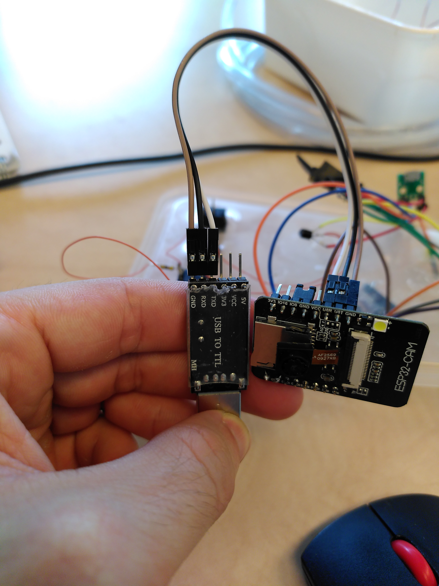

# Serre_connectee

## Flash un nouveau programme 

**Débrancher l'alimentation** de la carte.

Utiliser le convertisseur USB to TTL : 
- GND -> GND
- RXD -> U0T
- TXD -> U0R

utiliser un **jumper** pour connecter IO0 et GND sur l'ESP32.

Brancher l'**USB** au PC

Connecter l'**alimentation** de l'ESP32.

**Téléverser le programme sur l'ESP32 avec l'IDE arduino**

**Enlever le jumper** entre IO0 et GND

Débrancher l'alimentation et la rebrancher.

## Programmes

Le programme a utiliser / modifier pour l'ESP32 est le "final_version.ino". Il est sectionné en plusieurs fichiers contenant les différentes sous fonctions.

Le fichier (codes.gs)[code.gs] est le code google script qui communique avec l'ESP pour remplir le ggsheet et enregistrer les images. Ce script doit être déployer et le code de déploiement (AKfycbx-9i9Zu6WyBMAfQey_Hle-L-dqW94WVCNc_f8sVzF-vi08NC7xyscnGzp_XL6DOj6w par exemple) doit être insérer dans le programme .ino dans le fichier global_variables.

## liste des inspirations

sauvegarde des images dans ggdrive
https://github.com/gsampallo/esp32cam-gdrive

lire le spreadsheet
https://www.youtube.com/watch?v=0LoeaewIAdY

avoir l'heure depuis l'internet
https://randomnerdtutorials.com/esp32-date-time-ntp-client-server-arduino/

requêtes internet de base
https://randomnerdtutorials.com/esp32-http-get-post-arduino/#http-post

sleepmode
https://www.mischianti.org/2021/03/10/esp32-power-saving-modem-and-light-sleep-2/

## Améliorations directement possibles par ordre de difficulté

- changer les fils du ventilateur et de la pompe pour des fils plus gros et peut-être plus étanches
- changer les transistors npn pour des transistors NMOS : ça consomme moins
- ajouter un ads1115 pour la mesure de luminosité et d'autres ? (c'est compliqué parce que les pins de base sur l'ESP sont déjà pris)

